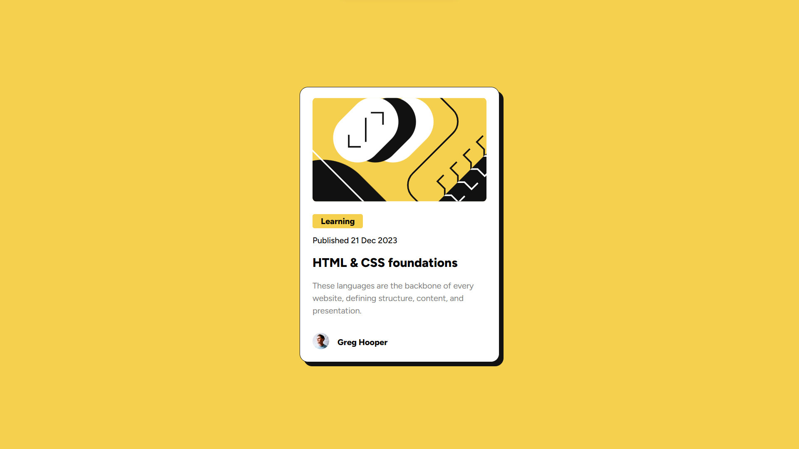

# Frontend Mentor - Blog preview card solution

This is a solution to the [Blog preview card challenge on Frontend Mentor](https://www.frontendmentor.io/challenges/blog-preview-card-ckPaj01IcS). Frontend Mentor challenges help you improve your coding skills by building realistic projects. 

## Table of contents

- [Overview](#overview)
  - [The challenge](#the-challenge)
  - [Screenshot](#screenshot)
  - [Links](#links)
- [My process](#my-process)
  - [Built with](#built-with)
  - [What I learned](#what-i-learned)
- [Author](#author)


## Overview

### The challenge

Users should be able to:

- See hover and focus states for all interactive elements on the page

### Screenshot




### Links

- Solution URL: [https://github.com/Mahendran-C/blog-preview-card]
- Live Site URL: [https://mahendran-c.github.io/blog-preview-card/]

## My process

### Built with

- Semantic HTML5 markup
- CSS custom properties
- Flexbox


### What I learned

i learned clamp() function for without using media query to change the font size


```css
.para{
    font-size: clamp(0.9rem, 3vw, 1rem );
}
```


## Author

- Frontend Mentor - [@Mahendran](https://www.frontendmentor.io/profile/Mahendran-C)
- Linkedln - [@Mahendran](https://www.linkedin.com/in/mahendran-c-1840b4174/)


